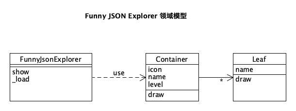
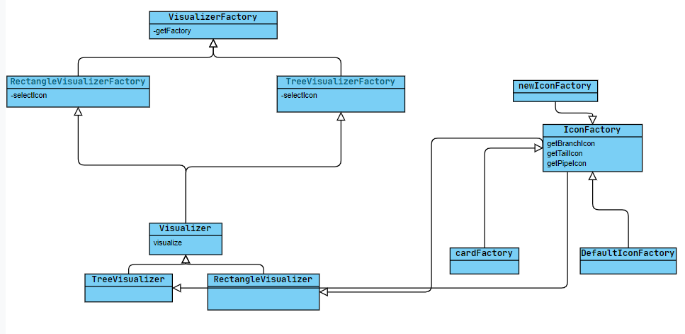
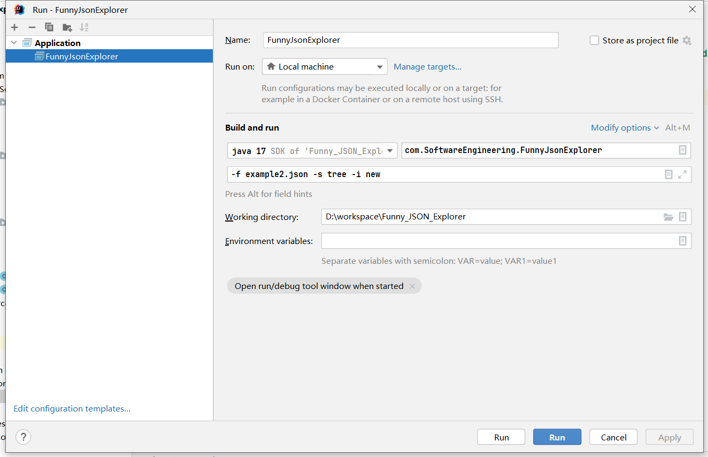
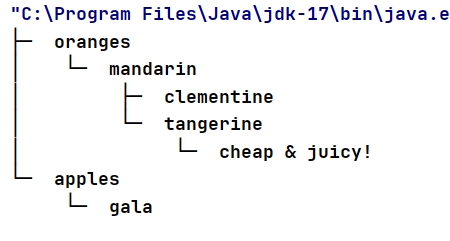
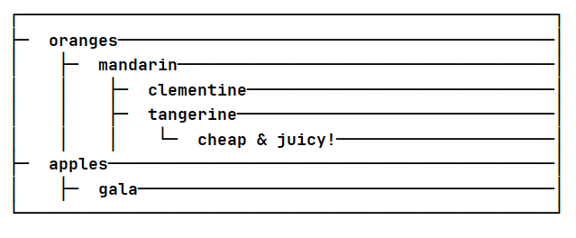
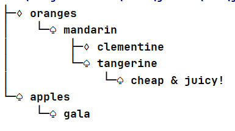
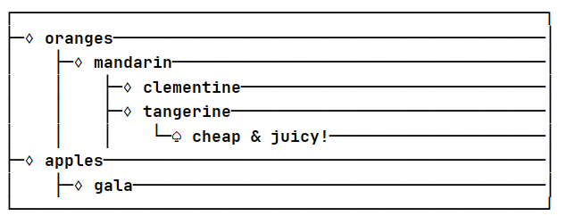

# Funny JSON Explorer

Funny JSON Explorer（**FJE**），是一个JSON文件可视化的命令行界面小工具

```shell
fje -f <json file> -s <style> -i <icon family>
```

```
{
    oranges: {
        'mandarin': {                            ├─ oranges
            clementine: null,                    │  └─ mandarin
            tangerine: 'cheap & juicy!'  -=>     │     ├─ clementine
        }                                        │     └─ tangerine: cheap & juicy!
    },                                           └─ apples
    apples: {                                       ├─ gala
        'gala': null,                               └─ pink lady
        'pink lady': null
    }
}
```

FJE可以快速切换**风格**（style），包括：树形（tree）、矩形（rectangle）；

```
├─ oranges                             ┌─ oranges ───────────────────────────────┐
│  └─ mandarin                         │  ├─ mandarin ───────────────────────────┤
│     ├─ clementine                    │  │  ├─ clementine ──────────────────────┤
│     └─ tangerine: cheap & juicy!     │  │  ├─ tangerine: cheap & juicy! ───────┤
└─ apples                              ├─ apples ────────────────────────────────┤
   └─ gala                             └──┴─ gala ───────────────────────────────┘

        树形（tree）                                   矩形（rectangle）
```

也可以指定**图标族**（icon family），为中间节点或叶节点指定一套icon

```
├─♢oranges                                 
│  └─♢mandarin                             
│     ├─♤clementine                        
│     └─♤tangerine: cheap & juicy!    
└─♢apples                                  
   └─♤gala                                 

poker-face-icon-family: 中间节点icon：♢ 叶节点icon：♤  
```

## 领域模型




## 作业要求

基于上述需求描述和领域模型，按照设计模式要求，进行软件设计，并编码实现（任何语言均可）。

### 设计模式

使用**工厂方法**（Factory）、**抽象工厂**（Abstract Factory）、**建造者**（Builder）模式、**组合模式**（Composition），完成功能的同时，使得程序易于扩展和维护。

1. （必做）：不改变现有代码，只需添加新的抽象工厂，即可添加新的风格
2. （选做）：通过配置文件，可添加新的图标族


## 简要实现

类图UML



- `VisualizerFactory`该抽象类用来对外提供接口，根据用户输入的是Tree还是Rec来选择树形风格还是矩形风格
- `RectangleVisualizerFactory`和`TreeVisualizerFactory`继承`VisualizerFactory`，用来选择对应的风格，并且根据输入的`iconFamily`来选择使用哪个图标族
- `Visualizer`该接口用来获取`JsonNode`
- `TreeVisualizer`和`RectangleVisualizer`继承接口`Visualizer`，并且具体实现树形结构和矩形结构
- `IconFactory`该接口定义了三个函数，分别用来实现分支符号，结尾符号和管道符号
- 可以通过添加新的`newFactory`类来添加图标族

## 添加新图标族示例

1. 添加新的工厂类，并且继承`IconFactory`接口

2. 用新的图标族实现，例如

   ```java
   public class newIcon implements IconFactory{
       @Override
       public String getBranchIcon() {
           return "├─♔ ";
       }
   
       @Override
       public String getTailIcon() {
           return "└─♕ ";
       }
   
       @Override
       public String getPipeIcon() {
           return "│    ";
       }
   }
   ```

   添加用”♔“来表示分支，用”♕“表示结尾

3. 在`RectangleVisualizerFactory`和`TreeVisualizerFactory`中添加显示该图标族所需要的指令

   ```java
   switch (iconFamily.toLowerCase()) {
       case "default":
           this.iconFactory = new DefaultIconFactory();
           break;
       case "card":
           this.iconFactory = new cardFactory();
           break;
      	// 添加新的
       case "new":
           this.iconFactory = new newIcon();
           break;
       default:
           throw new IllegalArgumentException("Unknown icon family: " + iconFamily);
   }
   ```


## 程序运行

我使用的是`idea`的Run功能



可以通过修改`Build and Run`来修改运行参数


## 运行结果

json文件如下：

```json
{
  "oranges": {
    "mandarin": {
      "clementine": {},
      "tangerine": "cheap & juicy!"
    }
  },
  "apples": {
    "gala": {}
  }
}
```

 树形结构运行如下 `-f example.json -s tree -i default`



矩形结构运行如下`-f example.json -s rec -i default`



使用card图标族

树形结构运行如下 `-f example.json -s tree -i card`



矩形结构运行如下`-f example.json -s rec -i card`


